# The Story Behind Animation and VFX

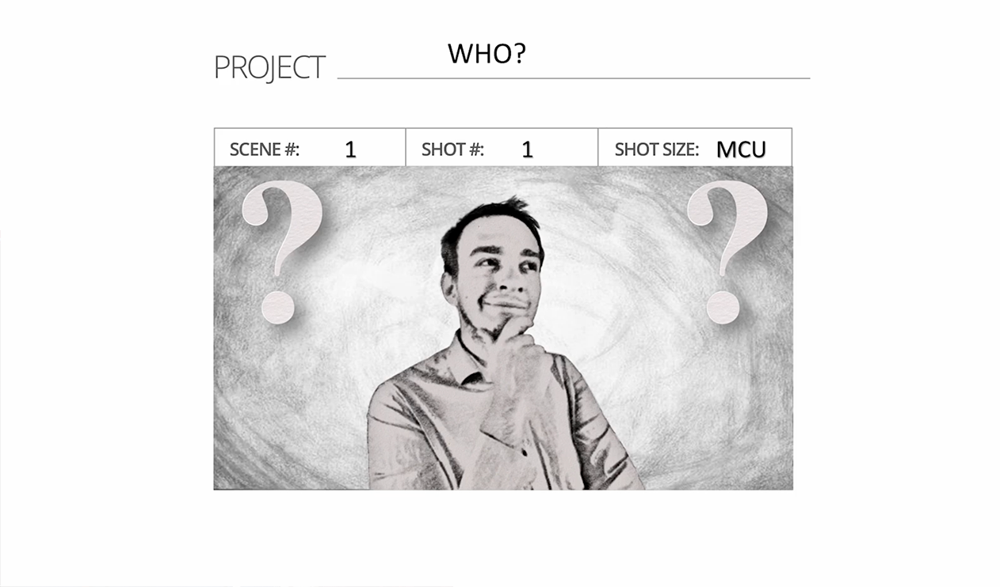

Often when I'm trying to introduce myself, it's quite interesting because I'm only able to show you **`THE COVER`** of my personality. Let me give you an example. One guy will say:

-------------------------------------------------------

> *THE GUY:*

Hi, Benjamin! Nice to meet you. By the way, what are you studying?

> *ME:*

Animation and visual effects.

> *THE GUY:*

"Wow, that’s really cool!" 

----------------------------------------------------

Sometimes I get these types of reactions. But when I have a short time to talk about my animation and visual effects field, I'm not able to give this person the story behind the animation and visual effects, and well... this is going to be our topic.

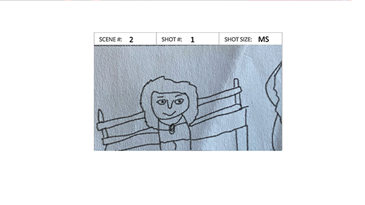
> *My silly drawing skills* 

So my secret is that as an animator, I can't draw. You can see it also in this photo. These were my drawing skills when I was younger. So it's funny, and, well... now I'm going to be honest with you. I mean, you will know more about my personality because I have time here to discuss it. My dream is to become a film director. 

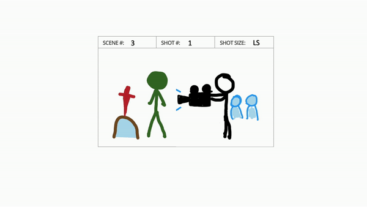

And I know, and also realize that it's a difficult journey, and it can also be painful. But inside me, I feel that this is something that I want to do. But of course, I also like other things. For example, I like to work with videos, sometimes animation and also, I like to think about camera movements or the right composition. So basically, almost everything about filmmaking. 

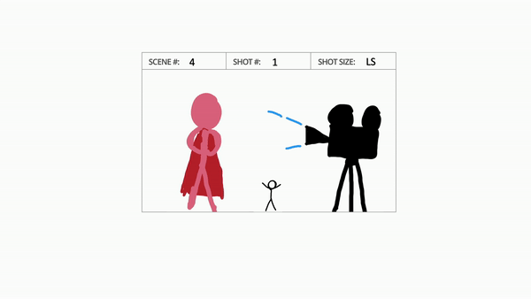

Also, you know, I was a background actor in some bigger productions, and I enjoyed being in front of the camera a little bit. Next, I enjoyed watching all film crew how they are trying to solve problems, how they are shooting different scenes. So it was an amazing experience, and the point is... 

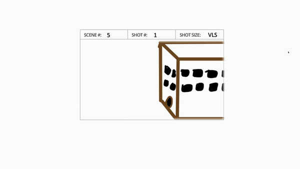

After my high school, I tried to apply to a film directing university in our capital city, Bratislava, but they didn't accept me, which was hurtful, but I was expecting that this is going to happen because it's really hard to apply there, honestly.

And we have only one university in Slovakia dedicated to filmmaking. I also know about a second university, but this university has a lot of bad reviews. So, you know, I tried at least to apply somewhere where I can study anything about filmmaking. And this is the reason why I'm here. I mean, I am a student at the University of Creative Communication, which specializes also in animation, and visual effects. 

## The Hard Beginning

The first class was also really difficult because we had professional lessons, and our teacher was also Slovak. He worked for Disney as a storyboarder and 2D animator. I don't remember exactly what he was doing, but if I remember well, he was working with the storyboards and 2D animation. And, you know, when he saw my drawing skills, my drawing skills were, like, you could see before. The teacher said to me:

> *THE PROFESSIONAL:*

**`"Benjamin, you’re at the university and you don't have the basic skills of drawing. If you really want to do this, you need to work on yourself very hard because with these types of drawing skills, you have no chance to apply to a professional studio."`** 

And I think he's right. I mean, he didn't tell me these sentences exactly how I'm telling you, but the meaning was something like this because I can't remember every detail of the sentence, but that was the meaning. And he was right. Thanks to this situation, I was asking myself if I am in the right place or, is it really true that with no drawing skills I won’t be a good filmmaker or these things..? or a good director? Because I met some teachers and they said to me that if I want to be a director, I should draw nicely because if I won't be able to draw nice things, then it will be really hard for me to be a film director. And these people are right. And this is the part where I want to motivate you to accept criticism, but when you feel this criticism is hurting your personality like a knife which is stuck in you and you're bleeding, you don't want to lose all blood because then you will die, right? So try to put this knife away as soon as possible. And I think this is helpful.

## Continuing journey

So, we need to find a balance between criticism, which can help us to improve, and criticism that is destroying our personality. If the criticism is destroying your personality, try to put it away as soon as possible. You know, my grandma gave me a perfect lesson, and she learned this lesson from her father as well. It's about accepting information with one ear inside and the other ear outside. In some things, it can be really helpful. Well, so it was really hard for me in the first class. And I want to motivate you in this way because I survived my university. I'm in the last class, by the way, and I can tell you I was patient, and I'm still following my dream, even though I realized that I can’t draw nicely as a future film director. We will see! 

Well... You know, after some time, I learned something. And when I was in Berlin, I did an internship there, and I was hanging out with my colleagues. We went to the bookshop, and there was a filmmaking section. So, you know, I like filmmaking. I went there, and I saw in front of me one book in English. And I felt that this book was calling me. When I came closer to this book, I opened it, and I felt like I was in a totally different world. My colleagues were checking other books, but I stuck with this book, and that's, as you can see, "Shot by Shot: Film Directing". 

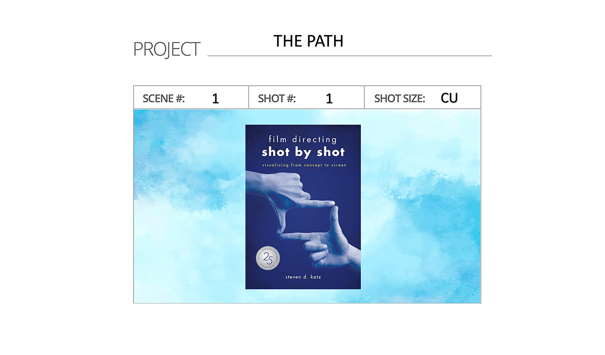

I learned a lot from this book, very motivational information, which I couldn't find at my university. And I'm not saying that it's a mistake of my university. It's just personal growth, it's my personal improvement. So this is also my advice. You can accept it, but of course, you don't have to. It's totally up to you. I just want to share my life story with you and motivate you because, you know, I have a lot of friends who are disappointed in themselves because they failed at something or, for some of my friends, what other people think is very important, which I think is not okay if you want to follow your dream. 

Also, search for other sources because, thanks to this, if you are searching for other sources, not just from your own place, you can be open-minded. And this book, in Berlin, helped me to understand some things. And the motivational part is coming now because you know my drawing skills... soooooo...

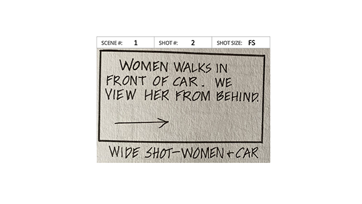

this is the easiest storyboard you can make. It's really cool! You know, guys, it's just that you need to use the right words to explain the story. 

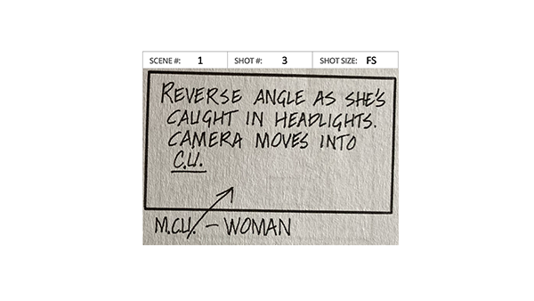

See? Another example... It's just the right words. And the storyboard editor will understand this. I don't know if in the Czech Republic, it works like that or in Slovakia, but I am pretty sure that abroad. If I go more abroad... they have these positions, and the storyboard editor will understand what I want to tell. Well, another example: 

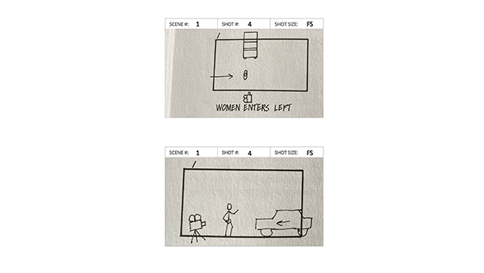

As you can see, you can use, like, two windows as one shot. So the window, which is up, looks like a map. So I can totally understand where the camera will be, where the character will move, where the car is. And the second window is just showing the camera angle and also the car movement. So thanks to these two windows, you can also explain the scene and people will understand. So there are a lot of options and variations. 

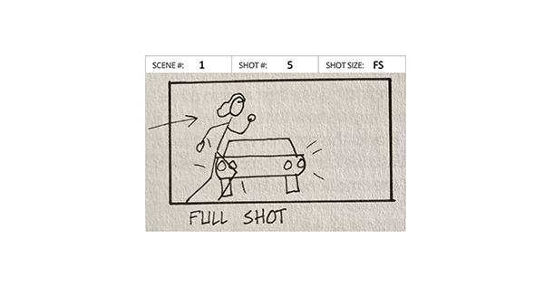

See also not professional drawing, and some famous directors made this type of shots, and we can totally understand what's the main point about this shot. 

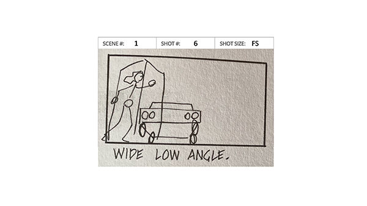

Also, with a rectangle, we can explain the perspective or the camera angle. Again, simple drawings. There's a rectangle that is helping us to understand the perspective and cooool! We understand! But of course, there's a situation when you need nice drawings. I'm not experienced, but I think if I want to sell some story to some producer and I need the money to make this project real, I will need nice drawings.

And I was wondering about myself... You know I'm not worried to ask for some help from an artist who can draw nicer than I. Thanks to this book, I learned to depict visuals better and how scenes should look. So, thanks to book, I can convey the story that is in my head. For example, I can ask for help from a storyboard artist or an artist who can realize and make nicer drawings of my concepts. Then probably the producer can like the visuals, how they look. So I learned that there are a lot of options in our life.

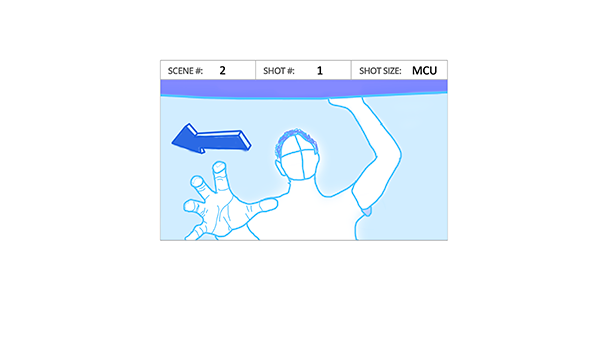

The next storyboard is not directly from the book, shot by shot. However, this is how I draw nowadays. Of course, if you give me a pencil and paper, I can draw as you saw before. Luckily, I've found my style. So, if I have a digital pen, tablet, and some computer, thanks to references, I can make better drawings. Of course, if I'm going to compare myself with other artists, they can draw nicer than I can. But I think this is really enough, and it's an improvement in my personality regarding how I want to better explain to you what my vision is and how I would like to tell the story. And this, for me, is important.

Remember, guys, this is my motivation for you. So if you feel the system is somehow trying to force you to do just one thing, always try to be open-minded and search for other sources. We have a lot of cultures here on this earth, and accepting criticism can really help you improve in some ways. But when you reach a point where you feel that criticism is hurting you and destroying your personality, try to put it away as soon as possible. Trust yourself! This is just my example of how I improved myself by being patient. Yes, I had to accept that I'm not as good as others, and I searched for some way, and after some time, I found it somehow. And I think that's how it works. If you're not scared to stand up and walk again and make a lot of failures... because you want your dream, right? Life is testing us to see if we really want what we want. So, yeah, search for other sources, accept criticism, but when you feel the criticism is destroying your personality, try to put it away as soon as possible.

## The Values

Well, with next photo, I would like to tell you what is also important in our lives. 

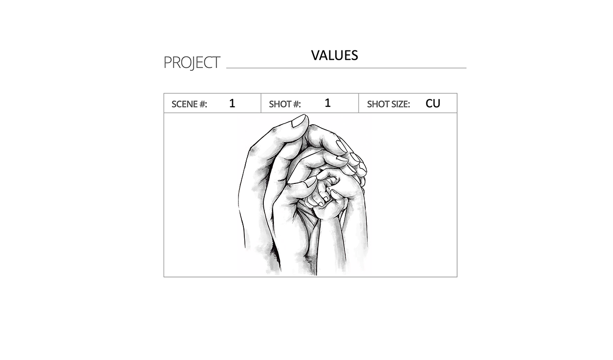

I mean, this is my point of view, and you can accept this or not; it's totally up to you. But what I've learned here on earth is that if you want to be truly happy, it's good to have honest friendships, good relationships with your family, and also when you are helping someone. These three things can help, in my opinion. Thanks to this, you can have the energy to always stand up and try to overcome failures. I mean, follow your journey. Also, you can feel really happy, and it will be easier for you to endure bad periods in your life. Because I've had bad periods in my life, and I hope you don't have... Well, probably you have bad periods in your life too, and I wish for you that you don't have so many. But I've learned that true friendships, honest relationships with your family, and helping others can help you overcome all obstacles in your life. And when you achieve your goals, you can feel truly happy and not lonely.

So, guys, remember that if you feel bad and you feel like you don't know what to do, I mean, you're still searching and trying to find out who you are, I just want to motivate you. Don't be scared, because I also had these struggles. Just try things, and you will see if you like them or not. Don't worry about trying, because then you can miss out on a lot of nice opportunities and memories in your life. Also, if you know what you want to do but you still have obstacles, I know this feeling, and I want to motivate you as well. Don't give up, because you will be surprised at how life can help you find who you really are and what you really want when you are trying to achieve your goal. You can become someone somehow or someone totally new, and you can be wise. Really, you can gain wisdom from all your life experiences, and you can help others. I think It's all connected somehow.

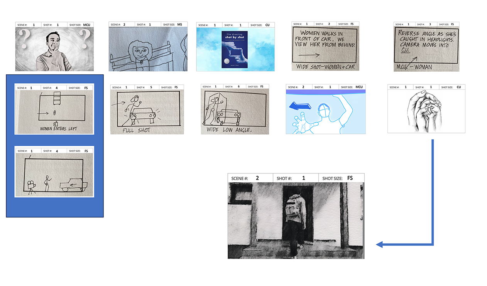

And as you can see in this photo, you know... Like every story has a beginning and an end. Also, this talk has a beginning and an end. And that's the same with our life. Our life has a beginning and an end. The question is, what are we going to do with the time that is given to us? 

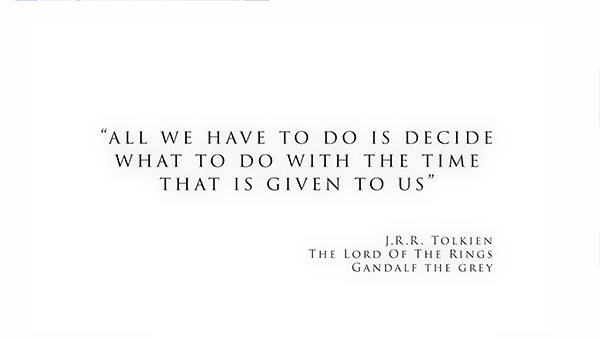

I think I'm probably quoting Gandalf from The Lord of the Rings, by the way I like Tolkien, but I think this is true; our life also has a beginning and an end, and we have no idea when our life is going to finish. I believe what we can bring with ourselves are experiences, memories, and values like good relationships with our family, true friendships, and when we help someone. Thanks to this, we are probably able to achieve goals or be somewhere where we always wanted to be. So, that's everything from me, guys. I wish you only good things in your life and a successful journey. I wish you true happiness as well because we often search for short-term happiness, and we try to catch this happiness, but we still feel somehow empty. I don't want to tell you what is real happiness for me because that's just totally my point of view. If I talk about it in more detail, that's another topic. I want you to find out for yourself. So again, I wish you a lot of good things in your life. Stay healthy; health is very important... And have a nice day!

# [VISUAL STORY](https://drive.google.com/file/d/1xb3BgfflX3RLkeS3FFgyVgtPNcVuSpsg/view?usp=share_link)

[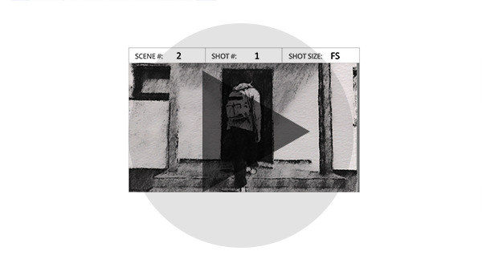](https://drive.google.com/file/d/1xb3BgfflX3RLkeS3FFgyVgtPNcVuSpsg/view?usp=share_link)
